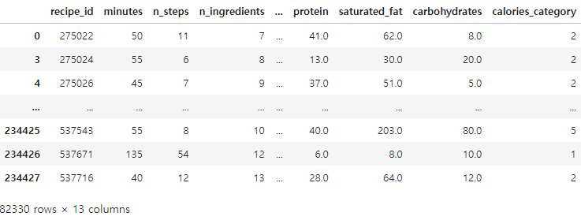
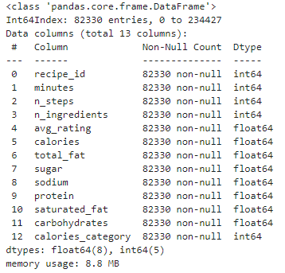

# Recipes_Calories_Analysis
**Name(s)**: Yujin Lee

**Website Link**: https://yul243.github.io/Recipes_Calories_Steps/

---
## Introduction

Foods are myriad worldwide, and numerous recipes exist accordingly. Recipes for the same food also vary depending on the cooking process and the combination of ingredients. In this project, we explore the presence of calorie changes based on the number of steps in a recipe. By examining the relationship between the number of steps in a recipe and calorie changes, we can understand the health effects of cooking complexity. This provides insights into dietary choices and cooking styles and can help foster healthy eating habits. In addition, the findings are expected to provide informative information to the culinary community or health professionals.

The project will use two datasets, both from food.com. The first is `recipes_df`, a dataset of cooking recipes from 2008 to 2018. It consists of 83782 rows and 12 columns. See the table below for a detailed description.

|Column	                 |Description|
|---                     |---        |
|`'name'	`            |Recipe name|
|`'id'`	                 |Recipe ID|
|`'minutes'`	         |Minutes to prepare recipe|
|`'contributor_id'`	     |User ID who submitted this recipe|
|`'submitted'`	            | Date recipe was submitted|
|`'tags'`	              |Food.com tags for recipe|
|`'nutrition'`	          |Nutrition information in the form [calories (#), total fat (PDV), sugar (PDV), sodium (PDV), protein    (PDV), saturated fat (PDV), carbohydrates (PDV)]; PDV stands for “percentage of daily value”|
|`'n_steps'`	          |Number of steps in recipe|
|`'steps'`	              |Text for recipe steps, in order|
|`'description'`	     | User-provided description|

The second data set is `interactions_df`, which evaluates and reviews recipes contained in `recipes_df`. It consists of 731927 rows and 5 columns.See the table below for a detailed description.

|Column|Description|
|---|---|
|`'user_id'`	|User ID|
|`'recipe_id'`	|Recipe ID|
|`'date'`	|Date of interaction|
|`'rating'`	|Rating given|
|`'review'`	|Review text|

In this study, we mainly used `n_steps` and `calories` columns. `n_steps` means the number of steps in that recipe. Nevertheless, to get a column, we need to convert the type of Nutrition column and extract it from it.

---
## Data Cleaning and Exploratory Data Analysis

### Data Cleaning

The following steps were used to clean the data.

> Data Frame Merge

The `recpies_df` and `interaction_df` were merged with their same columns, `id` and `recipe_id`. These steps allowed us to integrate recipes with information about their interactions.

> Average rating calculation

I calculated the average rating for each recipe and added it to a new column called `avg_rating`. I deleted the original rating column because it is no longer required for analysis.

> Duplicate row removal

 Duplicate rows were removed from the data frame because they could distort the analysis results. To ensure accuracy during the duplicate row removal process, we removed columns that might interfere with the deduplication.

> Select relevant columns

To focus on project aspects, we have preserved only columns that can help with the analysis. This step has made data frames simple and manageable.

> `nutrition`

The `nutrition` contained nutritional information in the original object format. To effectively use this information, we transformed the object into a list of dictionaries, each key representing individual nutritional values. The keys in the dictionaries represent individual nutritional information, so each value is stored in a new column, such as their key names.

> Maximum Calories Limit

For consistency and analytical relevance, we limited the maximum number of calories to 2000. These steps prevented outliers from excessively affecting the results.

> `calories` Classification

Calories were classified into five groups by value. Calories from 0 to 249 are classified into Category 1, from 250 to 499 are classified into Category 2, from 500 to 749 are classified into Category 3, from 750 to 999 are classified into Category 4, and over 1000 are classified into Category 5. These classifications help to analyze the distribution of calories by recipe.

After going through these data refinement steps, the first part of the data frame is:

This cleaned data frame is now ready for further analysis, allowing us to more effectively explore the relationship between the number of recipe steps and the calorie content.

### Univariate Analysis

In the univariate analysis, I analyzed the distribution of number of `calories` and the distribution of `number of steps`.

<iframe
  src="./assets/fig01.html"
  width="800"
  height="600"
  frameborder="0"
></iframe>

### Bivariate Analysis

### Interesting Aggregates
