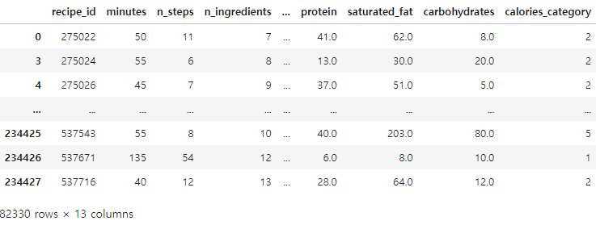
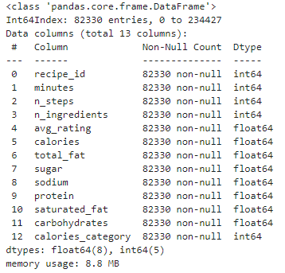
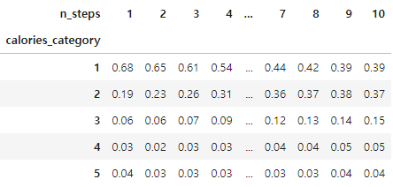
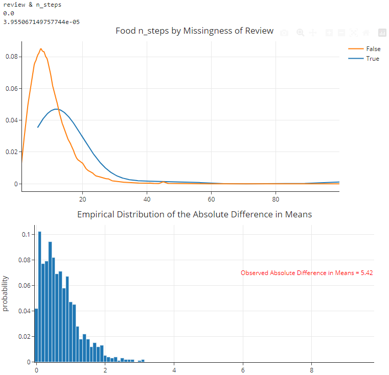
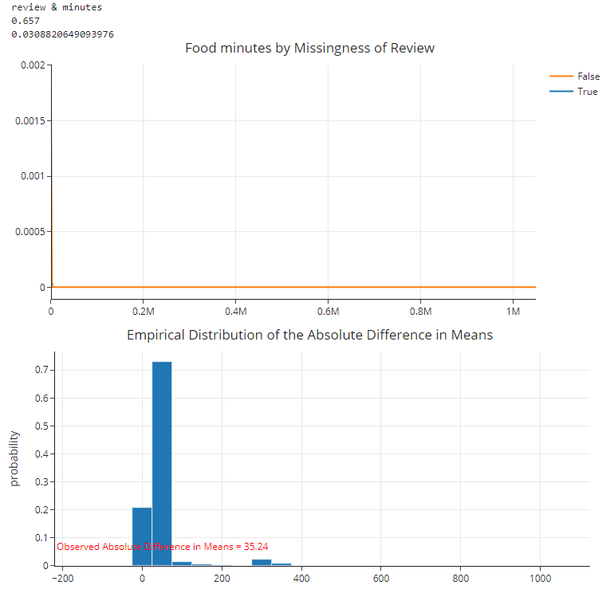
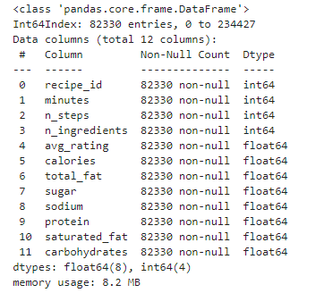

# Recipes_Calories_Analysis
**Name(s)**: Yujin Lee

**Website Link**: https://yul243.github.io/Recipes_Calories_Steps/

---
## Introduction

Foods are myriad worldwide, and numerous recipes exist accordingly. Recipes for the same food also vary depending on the cooking process and the combination of ingredients. In this project, we explore the presence of calorie changes based on the number of steps in a recipe. By examining the relationship between the number of steps in a recipe and calorie changes, we can understand the health effects of cooking complexity. This provides insights into dietary choices and cooking styles and can help foster healthy eating habits. In addition, the findings are expected to provide informative information to the culinary community or health professionals.

The project will use two datasets, both from food.com. The first is `recipes_df`, a dataset of cooking recipes from 2008 to 2018. It consists of 83782 rows and 12 columns. See the table below for a detailed description.

|Column	                 |Description|
|---                     |---        |
|`'name'	`            |Recipe name|
|`'id'`	                 |Recipe ID|
|`'minutes'`	         |Minutes to prepare recipe|
|`'contributor_id'`	     |User ID who submitted this recipe|
|`'submitted'`	            | Date recipe was submitted|
|`'tags'`	              |Food.com tags for recipe|
|`'nutrition'`	          |Nutrition information in the form [calories (#), total fat (PDV), sugar (PDV), sodium (PDV), protein    (PDV), saturated fat (PDV), carbohydrates (PDV)]; PDV stands for “percentage of daily value”|
|`'n_steps'`	          |Number of steps in recipe|
|`'steps'`	              |Text for recipe steps, in order|
|`'description'`	     | User-provided description|

The second data set is `interactions_df`, which evaluates and reviews recipes contained in `recipes_df`. It consists of 731927 rows and 5 columns.See the table below for a detailed description.

|Column|Description|
|---|---|
|`'user_id'`	|User ID|
|`'recipe_id'`	|Recipe ID|
|`'date'`	|Date of interaction|
|`'rating'`	|Rating given|
|`'review'`	|Review text|

In this study, we mainly used `n_steps` and `calories` columns. `n_steps` means the number of steps in that recipe. Nevertheless, to get a column, we need to convert the type of Nutrition column and extract it from it.

---
## Data Cleaning and Exploratory Data Analysis

### Data Cleaning

The following steps were used to clean the data.

> Data Frame Merge

The `recpies_df` and `interaction_df` were merged with their same columns, `id` and `recipe_id`. These steps allowed us to integrate recipes with information about their interactions.

> Average rating calculation

I calculated the average rating for each recipe and added it to a new column called `avg_rating`. I deleted the original rating column because it is no longer required for analysis.

> Duplicate row removal

 Duplicate rows were removed from the data frame because they could distort the analysis results. To ensure accuracy during the duplicate row removal process, we removed columns that might interfere with the deduplication.

> Select relevant columns

To focus on project aspects, we have preserved only columns that can help with the analysis. This step has made data frames simple and manageable.

> `nutrition`

The `nutrition` contained nutritional information in the original object format. To effectively use this information, we transformed the object into a list of dictionaries, each key representing individual nutritional values. The keys in the dictionaries represent individual nutritional information, so each value is stored in a new column, such as their key names.

> Maximum Calories Limit

For consistency and analytical relevance, we limited the maximum number of calories to 2000. These steps prevented outliers from excessively affecting the results.

> `calories` Classification

Calories were classified into five groups by value. Calories from 0 to 249 are classified into Category 1, from 250 to 499 are classified into Category 2, from 500 to 749 are classified into Category 3, from 750 to 999 are classified into Category 4, and over 1000 are classified into Category 5. These classifications help to analyze the distribution of calories by recipe.

After going through these data refinement steps, the first part of the data frame is:

This cleaned data frame is now ready for further analysis, allowing us to more effectively explore the relationship between the number of recipe steps and the calorie content.

### Univariate Analysis

In the univariate analysis, I analyzed the distribution of number of `calories` and the distribution of `number of steps`.

<iframe
  src="assets/fig01.html"
  width="800"
  height="600"
  frameborder="0"
></iframe>

<iframe
  src="assets/fig02.html"
  width="800"
  height="600"
  frameborder="0"
></iframe>

Both of these distributions appeared as a right-skewed. The center was located at about 165 to 174.9 for the `calories` distribution, and for the `n_steps`, the center was at 7.

### Bivariate Analysis

<iframe
  src="assets/fig03.html"
  width="800"
  height="600"
  frameborder="0"
></iframe>

We performed a bivariate analysis between `calories` and the `n_steps`. Bivariate analysis allows us to examine the relationship between the two variables. We can observe a steady increase in the third quartile and maximum value in the box plot above. We found a positive correlation between calories and the number of steps from this. This suggests that the calorie content also increases with increasing complexity of cooking.

### Interesting Aggregates

<iframe
  src="assets/fig04.html"
  width="800"
  height="600"
  frameborder="0"
></iframe>

We built a pivot table showing the conditional relative frequency distribution of `calories_categories` and `n_steps`. Only a small number of recipes from 1 to 10 were represented, all of which showed low to high percentages of calories. The higher the recipe moved to higher calories, the lower the percentage. This suggests that calories generally decrease as the number of steps in cooking decreases.

## Assessment of Missingness

### NMAR Analysis

Our dataset found missing data in three columns: name, description, and review. This omission suggests that these columns may be Not Missing at Random (NMAR). In other words, this omission occurs not with the values of other variables but with the values of the columns. For example, the name or description of a recipe would likely be missing in a recipe with a certain kind of dish or a particular characteristic. For this reason, additional data will be needed for this omission to become Missing at Random (MAR). Such data may provide information, such as the dish's characteristics or the user's behavior associated with the missing information.

### Missingness Dependency

`name`, `description`, `review`. Among them, an analysis of the missingness dependency of the `review` column was conducted.

Null Hypothesis: The missingness of `review` does not depend on `n_steps`
Alternative Hypothesis: The missingness of `review` depend on `n_steps`

We created a new column indicating whether the rating is missing and randomly mixed these columns to perform permutation. Since n_step is numeric, we used the mean difference between when the review is missing and when it is not missing as the absolute value to determine the test statistic.

Below is the n_step distribution with and without rating, and an empirical distribution of test statistics generated by 1000 permutations, with red lines representing the observed test statistics.

As a result of the above graph and permutation test, the null hypothesis is rejected because a p-value smaller than the significance level of 5% was obtained.

Null Hypothesis: The missingness of `review` does not depend on `minutes`
Alternative Hypothesis: The missingness of `review` depend on `minutes`

It was conducted in the same way as the above test.

As a result of the above graph and permutation test, the null hypothesis cannot be rejected because a p-value greater than the significance level of 5% was obtained.

## Hypothesis Testing

> Hypothesis

For a successful test, we changed the dataset accordingly. If the stage of the recipe is more then 10, it is defined as a complex stage, and if it is 10 or less, it is defined as a simple stage. 

Null Hypothesis(H ₀): "There is no difference in calories between  recipes with complex steps and recipes without complex steps."

Alternative Hypothesis(H ₐ) : "There is a difference in calories between recipes with complex steps and recipes without complex steps."

Test statistic: mean calorie difference between recipes with complex steps(n>10) and recipes without(n<=10).

Significance Level (α): 0.05

<iframe
  src="assets/fig05.html"
  width="800"
  height="600"
  frameborder="0"
></iframe>

> Result

Average calorie difference between recipes with and without complex steps observed: 102.37

p-value calculated from permutation test: 0.0

> Conclusion

With a significance level of 0.05 through 10,000 permutation tests, we reject the null hypothesis.

## Framing a Prediciton Problem

For prediction Problem we made new DataFrame.

### Problem Identification

> Prediction problems

It will predict the calories in the recipe, which we treat as a regression problem.

> Response variables

The response variable (target) is "calorie." This variable represents the energy content of a recipe and is essential information for managing dietary intake or following specific dietary plans.

> Reason for selection

Calories are a fundamental component of dietary assessment, influencing individuals' decisions about what and how much to consume. By accurately predicting calorie content, you can help achieve specific dietary goals, such as meal planning, diet tracking, weight management, or meeting nutrient requirements.

> Select Indicator

We will evaluate the regression model's performance by selecting R-squared and RMSE. R-squared indicates how well the model describes the variability of the dependent variable; the closer to 1, the better the model. This tells us how well the model describes the variability of the data. RMSE represents the difference between the model's predicted and actual values; the smaller the value, the more accurate the model's prediction. Therefore, we will evaluate the model's performance using these two metrics.

## Baseline Model

> Model Description

The reference model is a linear regression model.

> Features of the model

'total_fat': a quantitative characteristic.

'sugar': a quantitative characteristic.

> Encoding required

If the properties are quantitative, no particular encoding is required.

> Model performance

R-squared (R²): 0.786
Root Mean Squared Error (RMSE): 138.45

> Evaluate the current model

The R-squared value is 0.786, indicating that the model accounts for about 78.6% of the variability of the dependent variable.

The RMSE value is 138.45, indicating that the average of the prediction error is approximately 138.45.

The baseline model's performance is suitable, suggesting that it has significant explanatory power for calorie prediction.

> Visualize model performance

The graph below shows the relationship between the actual and predicted calories. The actual and predicted calories are generally consistent. Also, the red straight line is an identity line indicating when the actual and predicted values match perfectly.

<iframe
  src="assets/fig06.html"
  width="800"
  height="600"
  frameborder="0"
></iframe>

## Final Model

> Added attributes and reasons

The model included additional characteristics such as 'minutes,' 'n_steps,' and 'n_ingredients,' which are believed to help predict calories by providing important information such as recipe complexity, cooking time, and the number of ingredients used.

> Selected models and hyperparameters

Model: Lasso regression model

Hyperparameter: We found the optimal model by adjusting the alpha value of the Lasso regression.

> Final Model Performance

R-squared (R²): 0.99999988

RMSE: 0.102

> Improve Model Performance

For the Rasso regression model, the R-squared value is close to 1, the RMSE value is deficient, and the error between the actual and predicted values is tiny. This shows that the final model describes and predicts the data very well.

## Fairness Analysis

